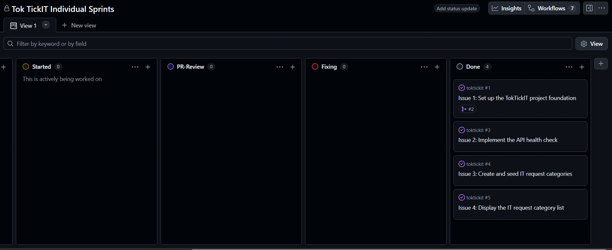

# PR Review Evidence — Lab 01

## My Information

| Field | Details |
| :--- | :--- |
| **Name** | Atiwit Thongngoen |
| **Student ID** | 67070501048 |
| **GitHub Username** | [@atiwit](https://github.com/atiwit) |

---

## First Reviewer Information

| Field | Details |
| :--- | :--- |
| **Name** | Alongkorn Kaewprom | 
| **Student ID** | 67070501050 | 
| **GitHub Username** | [@Alongkron1234](https://github.com/Alongkron1234) |

---

## Second Reviewer Information

| Field | Details |
| :--- | :--- |
| **Name** | NANTAKORN PINSUPAPORN |
| **Student ID** | 67070501028 |
| **GitHub Username** | [@copter549365](https://github.com/copter549365) |

---

## GitHub Project & Repository Links

- **Repository:** https://github.com/atiwit/toktickit
- **GitHub Project (Kanban Board):** [Link to Project Board] <!-- TODO: ใส่ลิงก์บอร์ดของคุณ -->
- **All Issues:**
  - [Issue #1 – Project Foundation](https://github.com/atiwit/toktickit/issues/1)
  - [Issue #2 – Health Check API](https://github.com/atiwit/toktickit/issues/2)
  - [Issue #3 – Category Seed](https://github.com/atiwit/toktickit/issues/3)
  - [Issue #4 – Category List](https://github.com/atiwit/toktickit/issues/4)

---

## Pull Requests Submitted

| PR | Title | Branch | Link |
| :--- | :--- | :--- | :--- |
| #2 | feat: Set up the TokTickIT project foundation | `feature/1-project-foundation` | https://github.com/atiwit/toktickit/pull/2 |
| #6 | feat: implement /api/health ตาม Criteria และ test API | `feature/2-health-check` | https://github.com/atiwit/toktickit/pull/6 |
| #7 | Feature/3 category seed | `feature/3-category-seed` | https://github.com/atiwit/toktickit/pull/7 |
| #8 | feat add category list + fix every test.ts lol | `feature/4-category-list` | https://github.com/atiwit/toktickit/pull/8 |
| #9 | Merging lab1-staging to main | `lab1-staging` | https://github.com/atiwit/toktickit/pull/9 |

---

## Evidence: My Partner Reviewed and Approved My PRs

### Partner who reviewed my PRs: @Alongkron1234 & @copter549365

**PR #2 – feat: Set up the TokTickIT project foundation** (Reviewed by @Alongkron1234)

> **Review Comment from my partner:**
> "ทำตามทีละสเต็ปได้เป๊ะ รวดเร็ว เป็นระเบียบและถูกต้องสมกับเป็นเพื่อนกูจริวๆ"

**My Response:**
> "ขอบคุณครับเพื่อน จะทำให้ดีแบบนี้อย่างสม่ำเสมอนะโบร๋"

**PR #6 – feat: implement /api/health ตาม Criteria และ test API** (Reviewed by @copter549365)

> **Review Comment from my partner:**
> "มีการเพิ่ม state สำหรับเก็บสถานะต่างๆเรียบร้อย มีการ clear error เก่าก่อนเริ่มเรียก API ดีมาก มีการเรียก API ไปที่ backend โดยรวมมีส่วนประกอบครบถ้วนสำหรับการทำ health ตาม Criteria"

**My Response:**
> "ขอบคุณสำหรับการ review ma bro copter , u r commented me like ur ma teacher bro."

**PR #7 – Feature/3 category seed** (Reviewed by @Alongkron1234)

> **Review Comment from my partner:**
> "มีไฟล์ Migration เรียบร้อย โค้ด seed สร้างข้อมูล 4 หมวดหมู่ทำงานถูกต้อง รันซ้ำไม่พัง โค้ดอ่านง่ายชัดเจนมากเพื่อน 👍"

**My Response:**
> "แต้งกิ้วเพื่อน เช็คละเอียดเลยนะเนี่ย😘😘"

**PR #8 – feat add category list + fix every test.ts lol** (Reviewed by @Alongkron1234)

> **Review Comment from my partner:**
> "API categories ดึงข้อมูลจาก DB ถูกต้อง หน้า UI แสดงผล 4 หมวดหมู่ มี Loading Error state ครบตาม Criteria รันเทสผ่านหมด สุดยอดมากเพื่อน 👍"

**My Response:**
> "Thank you so much for reviewing my code"

---

## Evidence: I Reviewed and Approved My Partner's PRs

### Partner's repository: https://github.com/Alongkron1234/toktickit

**PR I reviewed: Feature/1 project foundation** — [Link to PR #5](https://github.com/Alongkron1234/toktickit/pull/5)

> **My Review Comment:**
> "Bro Clean โค้ดได้สะอาดและสบายตา อ่านง่าย และครบตาม Criteria สุดยอด Ma bro!"

**Partner's Response:**
> "ขอบคุณสำหรับการ review ครับ"

**PR I reviewed: Create Category model and seed IT request categories** — [Link to PR #7](https://github.com/Alongkron1234/toktickit/pull/7)

> **My Review Comment:**
> "ทำตาม criteria ได้ครบ และ clean code ได้สบายตา อ่านง่ายชัดเจน"

**PR I reviewed: Feature/4 category list** — [Link to PR #8](https://github.com/Alongkron1234/toktickit/pull/8)

> **My Review Comment:**
> "It's enough brother, u got all u need bruh!"

---

## Kanban Board — All 4 Issues in Done

> **Screenshot of Kanban board with all issues in Done:**

| Issue | Title | Status |
| :--- | :--- | :--- |
| #1 | Project Foundation | ✅ Done |
| #2 | Health Check API | ✅ Done |
| #3 | Category Seed | ✅ Done |
| #4 | Category List | ✅ Done |
