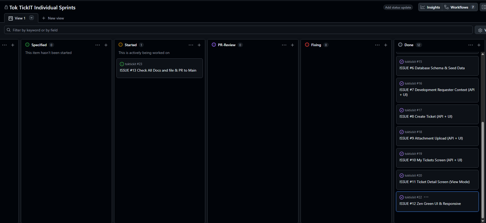

# PR Review Evidence — Lab 02

## My Information

| Field | Details |
| :--- | :--- |
| **Name** | Atiwit Thongngoen |
| **Student ID** | 67070501048 |
| **GitHub Username** | [@atiwit](https://github.com/atiwit) |

---

## First Reviewer Information

| Field | Details |
| :--- | :--- |
| **Name** | Alongkorn Kaewprom |
| **Student ID** | 67070501050 |
| **GitHub Username** | [@Alongkron1234](https://github.com/Alongkron1234) |

---

## Second Reviewer Information

| Field | Details |
| :--- | :--- |
| **Name** | NANTAKORN PINSUPAPORN |
| **Student ID** | 67070501028 |
| **GitHub Username** | [@copter549365](https://github.com/copter549365) |

---

## Third Reviewer Information

| Field | Details |
| :--- | :--- |
| **Name** | KITTITHAT DISTHANAKORNKUN |
| **Student ID** | 67070501004 |
| **GitHub Username** | [@JeffMerry](https://github.com/JeffMerry) |

---

## Fourth Reviewer Information

| Field | Details |
| :--- | :--- |
| **Name** | KRITTHAPHAT PANYASOMPHAN |
| **Student ID** | 67070501052 |
| **GitHub Username** | [@krittaphato3](https://github.com/krittaphato3) |

---

## GitHub Project & Repository Links

- **Repository:** https://github.com/atiwit/toktickit
- **GitHub Project (Kanban Board):** https://github.com/users/atiwit/projects/3
- **All Issues:**
  - [Issue #1 – Sprint Specification & Documentation](#)
  - [Issue #2 – Database Schema & Seed Data](#)
  - [Issue #3 – Development Requester Context](#)
  - [Issue #4 – Create Ticket](#)
  - [Issue #5 – Attachment Upload](#)
  - [Issue #6 – My Tickets Screen](#)
  - [Issue #7 – Ticket Detail Screen](#)
  - [Issue #8 – Automated Tests](#)
  - [Issue #9 – Zen Green UI Polish](#)
  - [Issue #10 – Release Integration](#)

---

## Pull Requests Submitted

| PR | Title | Branch | Link |
| :--- | :--- | :--- | :--- |
| #24 | add engineering documents skeleton for Issue #1 | `feature/lab2-specification` | [#24](https://github.com/atiwit/toktickit/pull/24) |
| #25 | feat(db): add full Lab 2 schema and idempotent seed | `feature/lab2-database` | [#25](https://github.com/atiwit/toktickit/pull/25) |
| #26 | feat: implement Requester Context & UI (Issue #3) | `feature/lab2-requester-context` | [#26](https://github.com/atiwit/toktickit/pull/26) |
| #27 | create ticket API and UI | `feature/lab2-create-ticket` | [#27](https://github.com/atiwit/toktickit/pull/27) |
| #28 | feat: attachment upload API, UI, and tests | `feature/lab2-attachments` | [#28](https://github.com/atiwit/toktickit/pull/28) |
| #29 | feat: implement My Tickets screen with API, UI, and tests | `feature/lab2-my-tickets` | [#29](https://github.com/atiwit/toktickit/pull/29) |
| #30 | feat: implement Ticket Detail screen and E2E testing | `feature/lab2-ticket-detail` | [#30](https://github.com/atiwit/toktickit/pull/30) |
| #31 | feat: implement Zen Green theme and responsive polish | `feature/lab2-ui-implement` | [#31](https://github.com/atiwit/toktickit/pull/31) |

---

## Evidence: My Partner Reviewed and Approved My PRs

### Partner who reviewed my PRs: @Alongkron1234, @copter549365, @JeffMerry, @krittaphato3

---

### [PR #24](https://github.com/atiwit/toktickit/pull/24) — add engineering documents skeleton · **Approved by @Alongkron1234**

**Review Comment from my partner (@Alongkron1234):**
> ไฟล์ ใน docs .md ครบถ้วนดีทุกอย่าง ผ่านไป Issue ต่อไปได้คับบ

*(หมายเหตุ: @Alongkron1234 ได้ถามเรื่องไฟล์ `lab02_extracted.txt` ก่อน)*

**My Response:**
> ไฟล์นั้นเป็นไฟล์ที่แปลงจาก PDF เพื่อให้ AI อ่านได้ละเอียดขึ้นครับ ไม่ใช่ไฟล์ที่ต้องส่ง

---

### [PR #25](https://github.com/atiwit/toktickit/pull/25) — feat(db): add full Lab 2 schema and idempotent seed · **Approved by @Alongkron1234, @copter549365**

**Review Comment from my partner (@Alongkron1234 / @copter549365):**
> แนะนำให้เพิ่ม Enum TicketStatus ให้ครอบคลุม status อื่นด้วย เพื่อรองรับ workflow ในอนาคต

**My Response:**
> อัปเดตเพิ่ม status ครบใน enum เรียบร้อยแล้วครับ (NEW, OPEN, IN_PROGRESS, RESOLVED, CLOSED)

---

### [PR #26](https://github.com/atiwit/toktickit/pull/26) — feat: implement Requester Context & UI · **Approved by @Alongkron1234, @copter549365**

**Review Comment from my partner (@Alongkron1234):**
> ดูจากไฟล์โค้ดต่างๆแล้วครบถ้วนตาม list ที่ให้มาดีมากครับ

---

### [PR #27](https://github.com/atiwit/toktickit/pull/27) — create ticket API and UI · **Approved by @Alongkron1234, @krittaphato3**

**Review Comment from my partner (@krittaphato3):**
> ยังขาด test ฝั่ง client และ API ครับ ควรเพิ่มให้ครบตาม Acceptance Criteria

**My Response:**
> เพิ่มไฟล์ test ทั้ง UI component และ API test เรียบร้อยแล้วครับ

**Review Comment from my partner (@krittaphato3) (หลังแก้ไข):**
> จากที่สังเกตุ ดู ตอนนี้ PR ครบตรงตาม Issue และ Acceptance Criteria แล้ว

---

### [PR #28](https://github.com/atiwit/toktickit/pull/28) — feat: attachment upload API, UI, and tests · **Approved by @JeffMerry, @krittaphato3**

**Review Comment from my partner (@JeffMerry):**
> Everything is good Mr.Atiwit. Ready to merge

**Review Comment from my partner (@krittaphato3):**
> ทุกส่วนมีครบและเรียบร้อยดีตาม Issue ครับ @atiwit Ready to merge

---

### [PR #29](https://github.com/atiwit/toktickit/pull/29) — feat: implement My Tickets screen · **Approved by @krittaphato3, @Alongkron1234, @copter549365**

**Review Comment from my partner:**
> ตรวจสอบโค้ด Frontend/Backend แล้วอนุมัติให้ merge ครับ

---

### [PR #30](https://github.com/atiwit/toktickit/pull/30) — feat: implement Ticket Detail screen and E2E testing · **Approved by @krittaphato3**

**Review Comment from my partner (@krittaphato3):**
> ควรเพิ่ม Playwright Screenshots ครบทั้ง 3 viewport (Desktop, Tablet, Mobile) ทุกหน้าครับ

**My Response:**
> เพิ่มรูป screenshots ครบ 3 viewports ใน `artifacts/lab-02/screenshots/` เรียบร้อยแล้วครับ

**Review Comment from my partner (@krittaphato3) (หลังแก้ไข):**
> ทุกอย่างเรียบร้อยและครบถ้วนดีครับ

---

### [PR #31](https://github.com/atiwit/toktickit/pull/31) — feat: implement Zen Green theme and responsive polish · **Approved by @Alongkron1234, @krittaphato3**

**Review Comment from my partner (@Alongkron1234):**
> UI ใน screenshot มีการแสดงผลทับซ้อนกันครับ ช่วยแก้ไขด้วย

**My Response:**
> แก้ไข UI ทับซ้อนเรียบร้อยแล้วครับ push fix แล้ว

**Review Comment from my partner (@krittaphato3) (หลังแก้ไข):**
> จากที่สังเกตุดูหลังจากแก้ไขในส่วนของที่ @Alongkron1234 ได้แจ้งไว้ ก็ถือว่า PR นี้สมบูรณ์แล้ว

---

## Evidence: I Reviewed and Approved My Partner's PRs

---

### Repo: [Alongkron1234/toktickit](https://github.com/Alongkron1234/toktickit)

---

### [PR #21](https://github.com/Alongkron1234/toktickit/pull/21) — Issue2: Update schema seed and migration · **Approved**

**My Review Comment:**
> โดยรวม Schema มีความครบถ้วน ครอบคลุม Model ที่จำเป็นทั้งหมดแล้ว ส่วน Seed data ที่ใส่มาก็มีความสมเหตุสมผล และช่วยให้ทดสอบ dev ได้สะดวก ส่วน Migration ไม่มีปัญหา

---

### [PR #22](https://github.com/Alongkron1234/toktickit/pull/22) — feat: implement develop requester, UI, active requester API · **Commented**

**My Review Comment:**
> โดยรวมแล้ว test ดีมากๆครับ แต่ในไฟล์ create-ticket.api.test.ts Test case 3 ไม่มีการ assert error.message ทั้งที่ test case 2 มี ควรทำให้มีเหมือนกันนะครับ

**Partner's Response (@Alongkron1234):**
> จิงด้วยตาไวมาก ตอนนี้ผมแก้ไฟล์ create-ticket.api.test.ts ให้มีการเช็ค error.message เหมือน test case2 เรียบร้อยแล้วครับ ฝากเช็คอีกทีคับปม

---

### [PR #23](https://github.com/Alongkron1234/toktickit/pull/23) — Issue4: create backend REST APIs and test file · **Approved**

**My Review Comment:**
> จากที่ผมดู คิดว่าตอนนี้น่าจะได้ backend api ครบถ้วน และเทสก็ปกติดี ลุยต่อได้ครับ!!

---

### [PR #25](https://github.com/Alongkron1234/toktickit/pull/25) — feat: implement GET API with ownership data, search, filter · **Approved**

**My Inline Comment:**
> search (search=battery) ตรวจแค่ว่า status 200 แต่ไม่ได้เช็คว่า ticket ที่ return มามีคำว่า "battery" จริงๆ เราควรเพิ่มขั้นตอนในการเช็คผลลัพธ์ที่กลับมาจาก return อีกครั้งไหมครับ @Alongkron1234

**Partner's Response (@Alongkron1234):**
> @atiwit อ๋ออันนี้อยู่ใน Commit ล่าสุด (8b2e03a) ได้มีการอัปเดตเพิ่มการตรวจสอบ Assertion ฝั่งผลลัพธ์ที่ส่งกลับมาจาก API เรียบร้อยแล้วครับ

**My Response:**
> โอเคครับ สุดยอดมาก

---

### [PR #26](https://github.com/Alongkron1234/toktickit/pull/26) — Issue7: Feature/my tickets UI · **Approved**

**My Review Comment:**
> โดยรวมแล้วโค้ดชัดเจนและไร้ข้อสงสัยครับ ผ่านได้ลุยต่อเลย @Alongkron1234

---

### [PR #28](https://github.com/Alongkron1234/toktickit/pull/28) — Issue9: add playwright e2e tests and multi-viewport screenshots · **Approved**

**My Review Comment:**
> ทุกอย่างดูครบถ้วนโอเคแล้วนะครับ ผ่านได้!!

---

### Repo: [krittaphato3/TokTickIT](https://github.com/krittaphato3/TokTickIT)

---

### [PR #28](https://github.com/krittaphato3/TokTickIT/pull/28) — feat: My Tickets UI — Issue #16 · **Approved**

**My Review Comment:**
> โดยรวมแล้วโอเคมากๆครับ ทุกอย่างดูดี ครบถ้วนสมบูรณ์

---

### [PR #34](https://github.com/krittaphato3/TokTickIT/pull/34) — feat: E2E flows, responsive screenshots, visual checklist · **Commented**

**My Inline Comment:**
> โดยรวมโอเคแล้วครับ แต่มีคำแนะนำนิดนึง ถ้าเปลี่ยนจากการดัก (if...throw Error) มาใช้ test() และ await expect(...) ของ Playwright แทน ผมว่ามันอาจจะดีกว่า เพราะว่ามันมีระบบรอโหลดให้อัตโนมัติ เราจะได้เอา waitForTimeout(400) ออกได้เลย เทสต์จะได้ไม่รวนด้วย

**Partner's Response (@krittaphato3):**
> ขอบคุณครับที่รีวิว เห็นด้วยครับ เดี๋ยวผมเปลี่ยน guard แบบ if...throw เป็น await expect(...) และเอา waitForTimeout(400) ออก ให้ Playwright auto-wait แทน แล้ว push fix ตามมาครับ

---

### [PR #35](https://github.com/krittaphato3/TokTickIT/pull/35) — release(lab2): Lab 2 Requester Ticketing MVP staging to main · **Approved**

**My Review Comment:**
> Approved bro! Everything is jingle bell!!

---

## Kanban Board — All Issues in Done

> **Screenshot of Kanban board with all issues in Done:**

| Issue | Title | Status |
| :--- | :--- | :--- |
| #1 | Sprint Specification & Documentation | ✅ Done |
| #2 | Database Schema & Seed Data | ✅ Done |
| #3 | Development Requester Context | ✅ Done |
| #4 | Create Ticket | ✅ Done |
| #5 | Attachment Upload | ✅ Done |
| #6 | My Tickets Screen | ✅ Done |
| #7 | Ticket Detail Screen | ✅ Done |
| #8 | Automated Tests | ✅ Done |
| #9 | Zen Green UI Polish | ✅ Done |
| #10 | Release Integration | ✅ Done |
